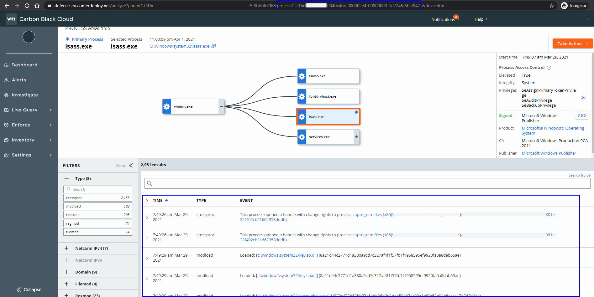
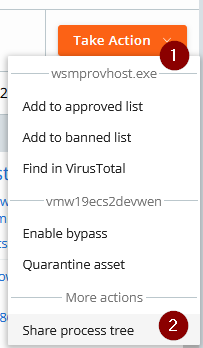
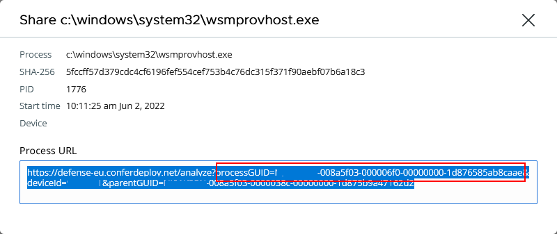
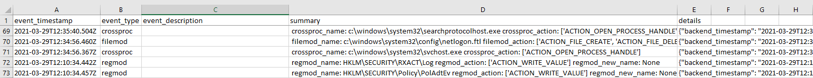
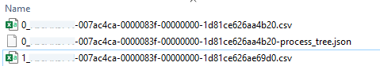

# Process Event Exporter

When performing an investigation, you can identify a suspicious process. It is a common practice to add into a timeline the events associated to that process. Events appear in the lower pane of the image below.



The script [export_process_events.py](export_process_events.py) helps to perform such an action by [exporting the events](https://developer.carbonblack.com/reference/carbon-black-cloud/platform/latest/platform-search-api-processes/#get-events-associated-with-a-given-process-v2) to a CSV file for latter analysis.

Additionally, it can follow __childproc__ events and recursively export their associated events and the parent-child ("process tree") relationship. This last in JSON format.

## Requirements

### Packages

- Carbon Black Cloud Python SDK.
- tdqm
- anytree

You can install them as part of:

```bash
pip install -r requirements.txt
```

### API Access Level

| Access Level | Permission | Description |
|--------------|------------|-------------|
|org.search.events|READ|Fetch the events|

## Usage

This script needs the following arguments:

- profile: [Carbon Black Cloud API SDK file profile to use](https://carbon-black-cloud-python-sdk.readthedocs.io/en/latest/authentication/#with-a-file).
- guid: [Process GUID](#how-to-get-the-process-guid).
- start: When to start the result search. ISO 8601 timestamp, e.g. YYYY-MM-DDTHH:mm:ssZ
- end: When to end the result search. ISO 8601 timestamp, e.g. YYYY-MM-DDTHH:mm:ssZ
- summary: Path to the [summary configuration file](#summary-file) that contains the attributes of the different event types to be included in the summary column.
- outfile: Path to the CSV file where to export the events.

And optionally:

- follow_childprocs: Number of nesting levels to follow chilproc events (~ children processes) and hence, export their associated events and parent-child relationship. __Note:__ The filename provided in the outfile argument will be ignored and only the path will be used.
- verbose: Flag to enable debug logging.

```bash
$ export_process_events.py 
usage: export_process_events.py [-h] [--profile PROFILE] --guid GUID --start
                                START --end END
                                [--follow_childprocs FOLLOW_CHILDPROCS]
                                --summary SUMMARY --outfile OUTFILE
                                [--verbose]

Process Event Exporter

optional arguments:
  -h, --help            show this help message and exit
  --profile PROFILE     profile to connect
  --guid GUID           Process GUID
  --start START         When to start the result search. ISO 8601 timestamp,
                        e.g. YYYY-MM-DDTHH:mm:ssZ
  --end END             When to end the result search. ISO 8601 timestamp,
                        e.g. YYYY-MM-DDTHH:mm:ssZ
  --follow_childprocs FOLLOW_CHILDPROCS
                        Number of nesting levels to follow children processes
                        to build and the process tree
  --summary SUMMARY     Path to the file that contains the attributes of the
                        different event types to be included in the summary
  --outfile OUTFILE     Path to the out file where to write
  --verbose             enable debug logging
```

### How to get the Process GUID

You can retrieve the process GUID of the _currently_ selected process by clicking on the button _Take Action_ and selecting the option menu _Share Process Tree_.



What does it mean the _currently_ selected process? The one highlighted in red within the process tree. Seeing the simple instructions above, you might think that the process GUID is then present in the URL (as highlighted in the first picture). However, this is misleading, because that is only valid when the Process Analysis page opens for the first time.

Therefore, always use the option _Share Process Tree_ to retrieve the process GUID of the highlighted process.



### Example of exporting events from a process

```bash
export_process_events.py --profile dev --guid "XXXXXXXX-0040c4bc-000002e4-00000000-1d7245f3bcf847c" --start "2021-03-29T12:00:00Z" --end "2021-03-29T16:00:00Z" --outfile 'PATH_TO/CSV_FILE.csv' --summary 'PATH_TO/summary.json' --verbose
```

This will result in a CSV file with the following columns:

- event_timestamp: Timestamp of the event. ISO 8601 timestamp format.
- event_type: [Carbon Black Cloud event type](https://community.carbonblack.com/t5/Knowledge-Base/EDR-What-are-the-Details-Behind-the-Event-Collection-Types/ta-p/81694).
- event_description: Event description (if it exists)
- summary: This column contains event attributes of interest that are defined in the [summary configuration file](#summary-file).
- details: Full event details.

|event_timestamp|event_type|event_description|summary|details|
|---------------|----------|-----------------|-------|-------|
|2021-03-29T15:54:11.178Z|crossproc||crossproc_name: c:\PATH_REDACTED\microsoftedgeupdate.exe crossproc_action: ['ACTION_OPEN_PROCESS_HANDLE']|{""backend_timestamp"": ""2021-03-29T15:56:33.225Z"", ""created_timestamp"": ""2021-04-01T10:19:28.143Z"", REDACTED , ""process_pid"": 740}|
|2021-03-29T15:20:17.505Z|netconn|The application ""<share><link hash=""fea3f1f82ac2109b5abd187d7a8c1688d99dc356f9f40dc904ac0b524f28b428"">C:\windows\system32\lsass.exe</link></share>"" established a <accent>UDP/389</accent> connection to <share><accent>A.B.C.D</accent></share><accent>:389</accent> (<share><accent>DC1.your.domain</accent></share>) from <share><accent>X.Y.Z.A</accent></share><accent>:51918</accent>. The device was off the corporate network using the public address <accent>UR.PUBLIC.IP.ADDR</accent> (<accent>HOST.your.domain</accent>, located in Somewhere, Country). The operation was successful.| netconn_inbound: False netconn_protocol: PROTO_UDP netconn_remote_ipv4: A.B.C.D netconn_remote_port: 389|{""backend_timestamp"": ""2021-03-29T15:20:48.978Z"", ""created_timestamp"": ""2021-04-01T10:19:28.144Z"", ""enriched"": true, REDACTED, ""process_pid"": 740}|



#### Example of exporting events following children processes

```bash
export_process_events.py --profile dev --guid "XXXXXXXX-0040c4bc-000002e4-00000000-1d7245f3bcf847c" --start "2021-03-29T12:00:00Z" --end "2021-03-29T16:00:00Z" --outfile 'PATH_TO/CSV_FILE.csv' --summary 'PATH_TO/summary.json' --follow_childprocs 2
```

In this case, on top of the CSV files (one per process), a JSON file will be created with the parent-child relationship.



```json
{
    "guid": "XXXXXXXX-007ac4ca-0000083f-00000000-1d81ce626aa4b20",
    "name": "",
    "pid": "",
    "level": 0,
    "children": [
        {
            "guid": "XXXXXXXX-007ac4ca-0000083f-00000000-1d81ce626ae69d0",
            "name": "/usr/lib/update-notifier/package-system-locked",
            "pid": 2111,
            "level": 1,
            "children": [
                {
                    "guid": "XXXXXXXX-007ac4ca-00000844-00000000-1d81ce626b854e0",
                    "name": "/usr/bin/fuser",
                    "pid": 2116,
                    "level": 2
                },
                {
                    "guid": "XXXXXXXX-007ac4ca-00000843-00000000-1d81ce626b3c100",
                    "name": "/usr/bin/fuser",
                    "pid": 2115,
                    "level": 2
                },
                {
                    "guid": "XXXXXXXX-007ac4ca-00000842-00000000-1d81ce626aeb7f0",
                    "name": "/usr/bin/fuser",
                    "pid": 2114,
                    "level": 2
                }
            ]
        }
    ]
}
```

### Summary file

This file is a JSON file that contains the attributes of those event types (__types__) that will be included in the summary column and the name of the transform function to apply to specific attributes (__transforms__).

The transform functions are defined in the module [transforms](events/transforms.py). Therefore, to add a new transform function in the JSON file it alo requires to be defined in that module. These transforms take only one argument: the value of the attribute to transform. For example:

```python
def int2ip(ip):
    """Returns the string representation of an IPv4 in CIDR format from an IPv4 in integer format.
    """    
    return str(socket.inet_ntoa(struct.pack('>i',ip)))
```

__Note:__ The attributes will be presented in the order they are defined in the JSON.

Below you can find an extract of the [JSON file](events/summary.json).

```json
{
    "types": {
        "childproc": [
            "childproc_username",
            "childproc_cmdline"
        ],
        "regmod": [
            "regmod_name",
            "regmod_action",
            "regmod_new_name"
        ],
        "filemod": [
            "filemod_name",
            "filemod_action",
            "filemod_hash"
        ],
        "modload": [
            "modload_name",
            "modload_action"
        ],
        "crossproc": [
            "crossproc_name",
            "crossproc_action"
        ],
        "netconn": [
            "netconn_inbound",
            "netconn_protocol",
            "netconn_remote_ipv4",
            "netconn_remote_port"
        ],
        "netconn_proxy": [
            "netconn_inbound",
            "netconn_protocol",
            "netconn_domain",
            "netconn_remote_port"
        ],
        "fileless_scriptload": [
            "fileless_scriptload_cmdline"
        ],
        "scriptload": [
            "scriptload_name"
        ]
    },
    "transforms": {
        "netconn_remote_ipv4": "int2ip"
    }
}
```
